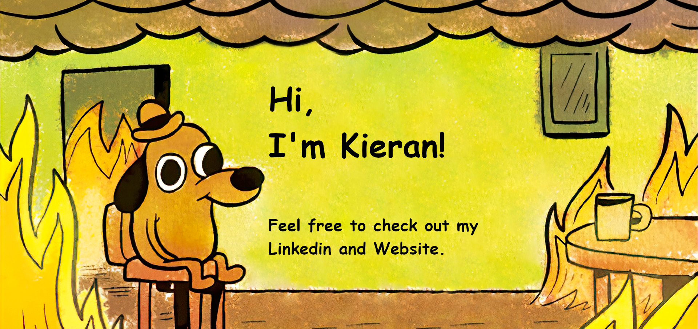

## 👋

Kieran.
Software Engineer @ The Office for National Statistics.
BSc (Hons) Computing Student @ The University of South Wales.

## 🔗

- [Linkedin](https://www.linkedin.com/in/kprit-dev/)
- [Website](https://totaldwarf.dev)

## 🛠️

- [AeroGIS](https://aerogis.totaldwarf.dev)
- [BusBee](https://busbee.totaldwarf.dev)

# 🐍

<picture>
  <source media="(prefers-color-scheme: dark)" srcset="https://raw.githubusercontent.com/TotalDwarf03/TotalDwarf03/output/github-contribution-grid-snake-dark.svg">
  <source media="(prefers-color-scheme: light)" srcset="https://raw.githubusercontent.com/TotalDwarf03/TotalDwarf03/output/github-contribution-grid-snake.svg">
  
</picture>
